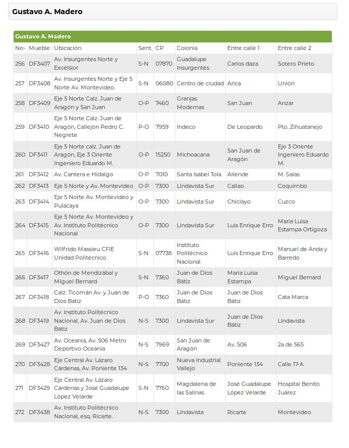
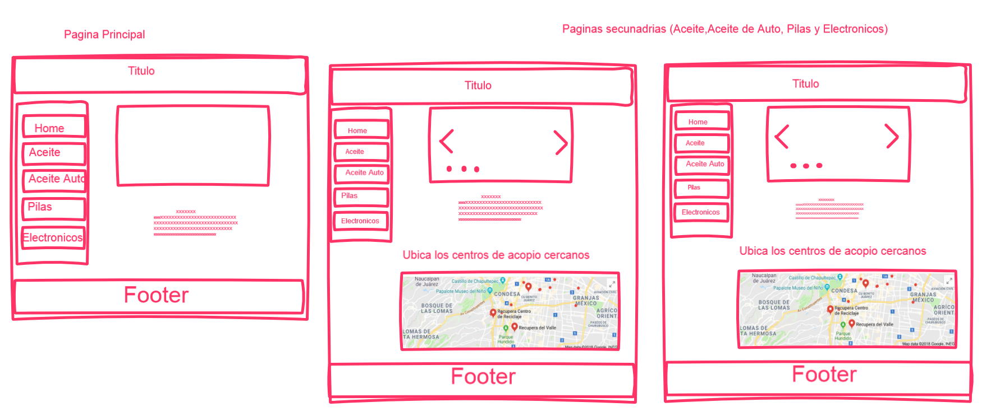

## Problematica

* Un problema acerca del reciclaje es el manejo de residuos, que tienen que ser manejados de forma especial como el aceite de cocina, aceite de auto motor y las pilas.

* La mayoria de la gente desconoce que existen lugares donde estas se pueden depositar para su posterior tratamiento.

* Algunas paginas de gobierno exponen estos lugares pero es simplemente texto con referencias mostradas en una tabla por delegación

# Muestra 

# Solución

* Se propone crear un mapa sobre los lugares donde la gente pueda dar estos residuos para su posterior tratamiento.(En el cual se muestran las ubicaciones de varios centros    de acopio cercanos).

* Tambien que contenga información sobre este tipo de residuos y la importacia de su manejo

# Referencias

* [Centros de acopio de pilas ](http://data.sedema.cdmx.gob.mx/sedema/index.php/ponte-las-pilas-con-tu-ciudad "Ubicación de centros de acopio")
* [Informacion sobre reciclaje de electronicos](https://verne.elpais.com/verne/2017/04/10/articulo/1491829997_551405.html "Reciclaje de electronicos")
* [Informacion sobre reciclaje en general](http://www.cempre.org.uy/para_joomla/preguntas_det.php?id=8&clave=8 "Reciclaje en general")
* [Informacion sobre reciclaje aceite automotor](https://www.ecologiaverde.com/contaminacion-del-aceite-usado-de-los-coches-101.html "Reciclaje de aceite automotor")
* [Informacion sobre reciclaje aceite comestible](http://www.reciclabien.com/comun/Documentos/Triptico%20ReciclaBien.pdf "Reciclaje de aceite comestible")

